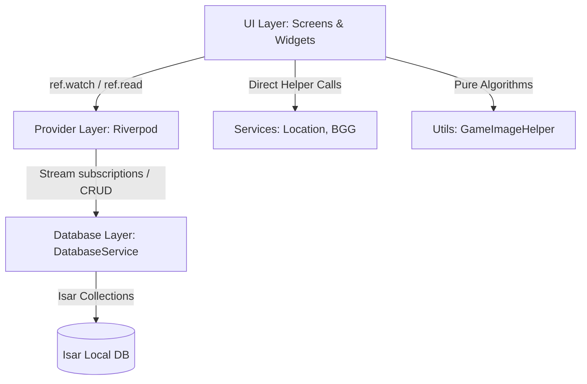

# Game Stats - Architecture & Data Flow

## 1. System Architecture

The application is structured into clean separation of concerns:

## 2. Layer Responsibilities

### UI Layer (`lib/ui/`)
- **Screens (`lib/ui/screens/`)**: Full-screen page widgets representing main routes:
  - `dashboard_screen.dart`: Quick stats, recent matches, shortcuts.
  - `match_history_screen.dart`: Chronological log of all recorded matches.
  - `game_library_screen.dart`: Catalog of games with match counts and fallback thumbnails.
  - `game_details_screen.dart`: Score chart, history, and player rankings for a specific game.
  - `players_screen.dart`: List of all registered players and stats.
  - `player_details_screen.dart`: Individual player profile, win rates, and match history.
  - `compare_players_screen.dart`: Head-to-head comparison between any two players with persistent selection.
  - `match_entry_screen.dart`: Match submission and editing form with silent GPS coordinate capture.
- **Widgets (`lib/ui/widgets/`)**: Reusable UI blocks (`LocationBadge`, `MatchRecordTile`, `MatchPreviewCard`, `ScoreChart`, `PlayerRankingCard`, etc.).

### Provider Layer (`lib/providers/`)
- `providers.dart`: Exposes `matchRecordsProvider`, `playersProvider`, `gamesProvider`, `globalStatisticsProvider`.
- `head_to_head_provider.dart`: Computes shared matches, head-to-head win counts, and placement comparisons between two players.

### Database Layer (`lib/data/`)
- `DatabaseService`: Singleton managing Isar instance initialization, collection queries, indexes, and reactive stream broadcasts.
- `models/`: Schema definitions for `Game`, `Player`, `MatchRecord`, and `@embedded` `PlayerScore`.

### Services & Utils (`lib/services/`, `lib/utils/`)
- `LocationService`: Handles permissions, silent GPS coordinate capture, in-memory cached reverse geocoding, and map app launching.
- `GameImageHelper`: Resolves image resolution hierarchy (custom game image -> match 1 photo -> match 2 photo -> ... -> null).
